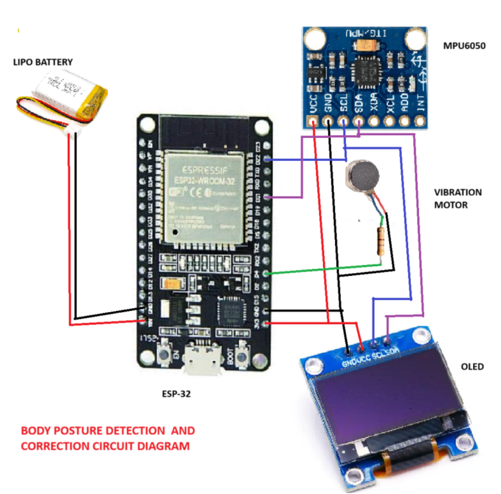

# BODY-POSTURE-DETECTION-AND-ALERTING-DEVIC

## Body Posture Detection and Correction Device

This project aims to create a body posture detection and alerting device using an ESP32 microcontroller, 
MPU6050 accelerometer and gyroscope, OLED display, and a vibration motor. The device alerts the user with 
a vibration when poor posture is detected and displays the posture status on the OLED screen using graphics.

## Components Used for the device

- ESP32-WROOM-32
- MPU6050 Accelerometer and Gyroscope
- 1.3" OLED Display
- Vibration Motor
- LiPo Battery
- Resistor (220 Ohms)
- Connecting Wires

## Circuit Diagram



## Wiring

- **MPU6050**
  - VCC to ESP32 3.3V
  - GND to ESP32 GND
  - SCL to ESP32 GPIO 22
  - SDA to ESP32 GPIO 21

- **OLED Display**
  - VCC to ESP32 3.3V
  - GND to ESP32 GND
  - SCL to ESP32 GPIO 22
  - SDA to ESP32 GPIO 21

- **Vibration Motor**
  - Positive terminal to ESP32 GPIO 4
  - Negative terminal to ESP32 GND
  - Resistor (220 Ohms) in series with the motor

- **LiPo Battery**
  - Positive terminal to ESP32 VIN
  - Negative terminal to ESP32 GND

## Installation for the project

### Prerequisites

- Arduino IDE
- ESP32 Board Package
- Adafruit MPU6050 Library
- u8g2 Library
- Adafruit GFX Library

### Steps

1. Install the ESP32 board package in Arduino IDE.
2. Install the required libraries from the Library Manager.
3. Clone this repository to your local machine.

```sh
git clone https://github.com/yourusername/body-posture-detection.git
cd body-posture-detection
```

4. Open the `body_posture_detection.ino` file in Arduino IDE.
5. Select the correct board and port.
6. Upload the code to the ESP32.

## Code Explanation

### Main Code

```cpp
// Main code

#include <Wire.h>
#include <U8g2lib.h>
#include <Adafruit_MPU6050.h>
#include <Adafruit_Sensor.h>
#include "bitmapheader.h"

Adafruit_MPU6050 mpu;
U8G2_SH1106_128X64_NONAME_F_HW_I2C u8g2(U8G2_R0, /* reset=*/ U8X8_PIN_NONE);

//#define MPU6050_ADDRESS 0x68  delete this later if not needed
//#define OLED_ADDRESS 0x3C
#define VIBRATION_PIN 5

// Threshold values for detecting poor posture with MPU6050 placed vertically
const float FORWARD_THRESHOLD = -5.0;  
const float BACKWARD_THRESHOLD = 5.0;  
const float LEFT_THRESHOLD = -5.0;     
const float RIGHT_THRESHOLD = 5.0;    

//Setup function 
void setup() {
  Serial.begin(115200);
  while (!Serial)
    delay(10);        // wait for serial port to connect. Needed for native USB

  Wire.begin(21, 22); // SDA pin 21, SCL pin 22

  if (!mpu.begin(MPU6050_ADDRESS, &Wire)) {
    Serial.println("Failed to find MPU6050 chip");
    while (1) {
      delay(10);
    }
  }

  mpu.setAccelerometerRange(MPU6050_RANGE_8_G);
  mpu.setGyroRange(MPU6050_RANGE_500_DEG);
  mpu.setFilterBandwidth(MPU6050_BAND_21_HZ);

  Serial.println("MPU6050 Found!");
  delay(10);

  u8g2.setBusClock(400000); // Optional: Set I2C bus speed for OLED
  u8g2.begin();
  u8g2.clearBuffer(); // Clearing the display buffer
  u8g2.setFont(u8g2_font_ncenB08_tr); // Font for a message
  u8g2.drawStr(0, 10, "Posture"); // Displaying a message
  u8g2.drawStr(0, 11, "Detection");
  u8g2.drawStr(0, 13, "&");
  u8g2.drawStr(0, 16, "Correction");
  u8g2.drawStr(0, 17, "Device");
  u8g2.sendBuffer(); // Sending the buffer to the display

  // Initialize]ing vibration motor pin
  pinMode(VIBRATION_PIN, OUTPUT);
  digitalWrite(VIBRATION_PIN, LOW);
}

//Loop function
void loop() {
  sensors_event_t a, g;
  mpu.getEvent(&a, &g);

  // Printing acceleration values for debugging
  Serial.print("AccelX: ");
  Serial.print(a.acceleration.x);
  Serial.print(", AccelY: ");
  Serial.print(a.acceleration.y);
  Serial.print(", AccelZ: ");
  Serial.print(a.acceleration.z);
  
   // Check posture with vertical placement
   //Leaning forward
    if (a.acceleration.z < FORWARD_THRESHOLD) {
      u8g2.clearBuffer();
      const int epd_bitmap_allArray_LEN = 1;
      const unsigned char* epd_bitmap_allArray[1] = {
	      epd_bitmap_nck_bnd_spn
      };// function calling for the bitmap
      u8g2.drawXBMP(0, 0, 128, 64, epd_bitmap_nck_bnd_spn);
      digitalWrite(VIBRATION_PIN, HIGH);  // Turning on vibration motor
      Serial.println("Leaning Forward");
      u8g2.drawStr(50,40,"Leaning ");
      u8g2.drawStr(50,50, "Forward");
      u8g2.sendBuffer();
    } 
    // Leaning backward
    else if (a.acceleration.z > BACKWARD_THRESHOLD) {
      u8g2.clearBuffer();
      const int epd_bitmap_allArray_LEN = 1;
      const unsigned char* epd_bitmap_allArray[1] = {
	      epd_bitmap_bck_bnd_spn
      };
      u8g2.drawXBMP(0, 0, 128, 64, epd_bitmap_bck_bnd_spn);
      digitalWrite(VIBRATION_PIN, HIGH);  // Turning on vibration motor
      Serial.println("Leaning Backward");
      u8g2.drawStr(50,40,"Leaning ");     //Setting the position and printing the message
      u8g2.drawStr(50, 50, "Backward");
      u8g2.sendBuffer();
    } 
    // Leaning left
    else if (a.acceleration.y > RIGHT_THRESHOLD) {
      u8g2.clearBuffer();
      const int epd_bitmap_allArray_LEN = 1;
      const unsigned char* epd_bitmap_allArray[1] = {
	      epd_bitmap_lft_crs_spn
      };
    u8g2.drawXBMP(0, 0, 128, 64, epd_bitmap_lft_crs_spn);
    digitalWrite(VIBRATION_PIN, HIGH);  // Turn on vibration motor
    Serial.println("Leaning Left");
    u8g2.drawStr(50,40,"Leaning ");
    u8g2.drawStr(50, 50, "Left");
    u8g2.sendBuffer();
  } 
  // Leaning right
  else if (a.acceleration.y < LEFT_THRESHOLD) {
    u8g2.clearBuffer();
    const int epd_bitmap_allArray_LEN = 1;
    const unsigned char* epd_bitmap_allArray[1] = {
	    epd_bitmap_rght_crs_spn
    };
    u8g2.drawXBMP(0, 0, 128, 64, epd_bitmap_rght_crs_spn);
    digitalWrite(VIBRATION_PIN, HIGH);  // Turn on vibration motor
    Serial.println("Leaning Right");
    u8g2.drawStr(65,40,"Leaning");
    u8g2.drawStr(65, 50,"Right");
    u8g2.sendBuffer();
  }
  //Good posture
  else {
    u8g2.clearBuffer(); 
    const int epd_bitmap_allArray_LEN = 1;
    const unsigned char* epd_bitmap_allArray[1] = {
	    epd_bitmap_stght_spn
    };
    digitalWrite(VIBRATION_PIN, LOW); 
    u8g2.drawXBMP(0, 0, 128, 64, epd_bitmap_stght_spn);
    Serial.println("Good Posture");
    u8g2.drawStr(60, 40, "Good"); 
    u8g2.drawStr(60, 50, "Posture");
    u8g2.sendBuffer();
  }

  delay(500); // delay of 500 mili second
}

//bitmapheader

#ifndef BITMAPS_H
#define BITMAPS_H

// Backward Bend
 const unsigned char epd_bitmap_bck_bnd_spn [] PROGMEM = {
	0x00, 0x00, 0x00, 0x00, 0x00, 0x00, 0x00, 0x00, 0x00, 0x00, 0x00, 0x00, 0x00, 0x00, 0x00, 0x00, 
	0x00, 0x00, 0x00, 0x00, 0x00, 0x00, 0x00, 0x00, 0x00, 0x00, 0x00, 0x00, 0x00, 0x00, 0x00, 0x00, 
	0x00, 0x00, 0x00, 0x00, 0x00, 0x00, 0x00, 0x00, 0x00, 0x00, 0x00, 0x00, 0x00, 0x00, 0x00, 0x00, 
	0x00, 0x00, 0x00, 0x00, 0x00, 0x00, 0x00, 0x00, 0x00, 0x00, 0x00, 0x00, 0x00, 0x00, 0x00, 0x00, 
	0x00, 0x00, 0x00, 0x00, 0x00, 0x00, 0x00, 0x00, 0x00, 0x00, 0x00, 0x00, 0x00, 0x00, 0x00, 0x00, 
	0x00, 0x00, 0x00, 0x00, 0x00, 0x00, 0x00, 0x00, 0x00, 0x00, 0x00, 0x00, 0x00, 0x00, 0x00, 0x00, 
	0x00, 0x00, 0x00, 0x00, 0x00, 0x00, 0x00, 0x00, 0x00, 0x00, 0x00, 0x00, 0x00, 0x00, 0x00, 0x00, 
	0x00, 0x00, 0x00, 0x00, 0x00, 0x00, 0x00, 0x00, 0x00, 0x00, 0x00, 0x00, 0x00, 0x00, 0x00, 0x00, 
	0x00, 0x00, 0x00, 0xe0, 0x00, 0x00, 0x00, 0x00, 0x00, 0x00, 0x00, 0x00, 0x00, 0x00, 0x00, 0x00, 
	0x00, 0x00, 0x00, 0xf0, 0x01, 0x00, 0x00, 0x00, 0x00, 0x00, 0x00, 0x00, 0x00, 0x00, 0x00, 0x00, 
	0x00, 0x00, 0x00, 0xf8, 0x03, 0x00, 0x00, 0x00, 0x00, 0x00, 0x00, 0x00, 0x00, 0x00, 0x00, 0x00, 
	0x00, 0x00, 0x00, 0xf8, 0x03, 0x00, 0x00, 0x00, 0x00, 0x00, 0x00, 0x00, 0x00, 0x00, 0x00, 0x00, 
	0x00, 0x00, 0x00, 0xf8, 0x03, 0x00, 0x00, 0x00, 0x00, 0x00, 0x00, 0x00, 0x00, 0x00, 0x00, 0x00, 
	0x00, 0x00, 0x00, 0xf8, 0x03, 0x00, 0x00, 0x00, 0x00, 0x00, 0x00, 0x00, 0x00, 0x00, 0x00, 0x00, 
	0x00, 0x00, 0x00, 0xf8, 0x03, 0x00, 0x00, 0x00, 0x00, 0x00, 0x00, 0x00, 0x00, 0x00, 0x00, 0x00, 
	0x00, 0x00, 0x00, 0xf8, 0x03, 0x00, 0x00, 0x00, 0x00, 0x00, 0x00, 0x00, 0x00, 0x00, 0x00, 0x00, 
	0x00, 0x00, 0x00, 0xf8, 0x03, 0x00, 0x00, 0x00, 0x00, 0x00, 0x00, 0x00, 0x00, 0x00, 0x00, 0x00, 
	0x00, 0x00, 0x00, 0xf0, 0x03, 0x00, 0x00, 0x00, 0x00, 0x00, 0x00, 0x00, 0x00, 0x00, 0x00, 0x00, 
	0x00, 0x00, 0x80, 0xe0, 0x03, 0x00, 0x00, 0x00, 0x00, 0x00, 0x00, 0x00, 0x00, 0x00, 0x00, 0x00, 
	0x00, 0x00, 0xc0, 0x38, 0x00, 0x00, 0x00, 0x00, 0x00, 0x00, 0x00, 0x00, 0x00, 0x00, 0x00, 0x00, 
	0x00, 0x00, 0xc0, 0x3c, 0x00, 0x00, 0x00, 0x00, 0x00, 0x00, 0x00, 0x00, 0x00, 0x00, 0x00, 0x00, 
	0x00, 0x00, 0x40, 0x3c, 0x80, 0x00, 0x00, 0x00, 0x00, 0x00, 0x00, 0x00, 0x00, 0x00, 0x00, 0x00, 
	0x00, 0x00, 0x20, 0x3e, 0xc0, 0x00, 0x00, 0x00, 0x00, 0x00, 0x00, 0x00, 0x00, 0x00, 0x00, 0x00, 
	0x00, 0x00, 0x30, 0x3e, 0xe0, 0x3f, 0x00, 0x00, 0x00, 0x00, 0x00, 0x00, 0x00, 0x00, 0x00, 0x00, 
	0x00, 0x00, 0x30, 0x7f, 0xe0, 0x3f, 0x00, 0x00, 0x00, 0x00, 0x00, 0x00, 0x00, 0x00, 0x00, 0x00, 
	0x00, 0x00, 0x10, 0xff, 0xc0, 0x00, 0x00, 0x00, 0x00, 0x00, 0x00, 0x00, 0x00, 0x00, 0x00, 0x00, 
	0x00, 0x00, 0x00, 0xdf, 0x01, 0x00, 0x00, 0x00, 0x00, 0x00, 0x00, 0x00, 0x00, 0x00, 0x00, 0x00, 
	0x00, 0x00, 0x10, 0xbf, 0x03, 0x00, 0x00, 0x00, 0x00, 0x00, 0x00, 0x00, 0x00, 0x00, 0x00, 0x00, 
	0x00, 0x00, 0x10, 0x7f, 0x07, 0x00, 0x00, 0x00, 0x00, 0x00, 0x00, 0x00, 0x00, 0x00, 0x00, 0x00, 
	0x00, 0x00, 0x10, 0x7f, 0x07, 0x00, 0x00, 0x00, 0x00, 0x00, 0x00, 0x00, 0x00, 0x00, 0x00, 0x00, 
	0x00, 0x00, 0x10, 0xff, 0x0f, 0x00, 0x00, 0x00, 0x00, 0x00, 0x00, 0x00, 0x00, 0x00, 0x00, 0x00, 
	0x00, 0x00, 0x00, 0xff, 0x0e, 0x00, 0x00, 0x00, 0x00, 0x00, 0x00, 0x00, 0x00, 0x00, 0x00, 0x00, 
	0x00, 0x00, 0x20, 0xfe, 0x1e, 0x00, 0x00, 0x00, 0x00, 0x00, 0x00, 0x00, 0x00, 0x00, 0x00, 0x00, 
	0x00, 0x00, 0x60, 0xfe, 0x1e, 0x00, 0x00, 0x00, 0x00, 0x00, 0x00, 0x00, 0x00, 0x00, 0x00, 0x00, 
	0x00, 0x00, 0x40, 0xfc, 0x3e, 0x00, 0x00, 0x00, 0x00, 0x00, 0x00, 0x00, 0x00, 0x00, 0x00, 0x00, 
	0x00, 0x00, 0x00, 0xf8, 0x3f, 0x03, 0x00, 0x00, 0x00, 0x00, 0x00, 0x00, 0x00, 0x00, 0x00, 0x00, 
	0x00, 0x00, 0x80, 0xf9, 0x3f, 0x03, 0x00, 0x00, 0x00, 0x00, 0x00, 0x00, 0x00, 0x00, 0x00, 0x00, 
	0x00, 0x00, 0x00, 0xf1, 0x7d, 0x02, 0x00, 0x00, 0x00, 0x00, 0x00, 0x00, 0x00, 0x00, 0x00, 0x00, 
	0x00, 0x00, 0x00, 0xe3, 0x7f, 0x02, 0x00, 0x00, 0x00, 0x00, 0x00, 0x00, 0x00, 0x00, 0x00, 0x00, 
	0x00, 0x00, 0x00, 0xe0, 0x7b, 0x00, 0x00, 0x00, 0x00, 0x00, 0x00, 0x00, 0x00, 0x00, 0x00, 0x00, 
	0x00, 0x00, 0x00, 0xc6, 0x77, 0x04, 0x00, 0x00, 0x00, 0x00, 0x00, 0x00, 0x00, 0x00, 0x00, 0x00, 
	0x00, 0x00, 0x60, 0xcc, 0xef, 0x04, 0x00, 0x00, 0x00, 0x00, 0x00, 0x00, 0x00, 0x00, 0x00, 0x00, 
	0x00, 0x00, 0xe0, 0xcc, 0xff, 0x04, 0x00, 0x00, 0x00, 0x00, 0x00, 0x00, 0x00, 0x00, 0x00, 0x00, 
	0x00, 0x00, 0xfc, 0xc1, 0xde, 0x00, 0x00, 0x00, 0x00, 0x00, 0x00, 0x00, 0x00, 0x00, 0x00, 0x00, 
	0x00, 0x00, 0xe0, 0xcc, 0xfe, 0x04, 0x00, 0x00, 0x00, 0x00, 0x00, 0x00, 0x00, 0x00, 0x00, 0x00, 
	0x00, 0x00, 0x60, 0xcc, 0xfd, 0x0c, 0x00, 0x00, 0x00, 0x00, 0x00, 0x00, 0x00, 0x00, 0x00, 0x00, 
	0x00, 0x00, 0x00, 0xcc, 0xbd, 0x0c, 0x00, 0x00, 0x00, 0x00, 0x00, 0x00, 0x00, 0x00, 0x00, 0x00, 
	0x00, 0x00, 0x00, 0xc4, 0xfb, 0x04, 0x00, 0x00, 0x00, 0x00, 0x00, 0x00, 0x00, 0x00, 0x00, 0x00, 
	0x00, 0x00, 0x00, 0xe0, 0x7f, 0x00, 0x00, 0x00, 0x00, 0x00, 0x00, 0x00, 0x00, 0x00, 0x00, 0x00, 
	0x00, 0x00, 0x00, 0xe0, 0x77, 0x00, 0x00, 0x00, 0x00, 0x00, 0x00, 0x00, 0x00, 0x00, 0x00, 0x00, 
	0x00, 0x00, 0x00, 0xe0, 0x7f, 0x00, 0x00, 0x00, 0x00, 0x00, 0x00, 0x00, 0x00, 0x00, 0x00, 0x00, 
	0x00, 0x00, 0x00, 0xe0, 0x6f, 0x00, 0x00, 0x00, 0x00, 0x00, 0x00, 0x00, 0x00, 0x00, 0x00, 0x00, 
	0x00, 0x00, 0x00, 0xe0, 0xff, 0x00, 0x00, 0x00, 0x00, 0x00, 0x00, 0x00, 0x00, 0x00, 0x00, 0x00, 
	0x00, 0x00, 0x00, 0xc0, 0xff, 0x00, 0x00, 0x00, 0x00, 0x00, 0x00, 0x00, 0x00, 0x00, 0x00, 0x00, 
	0x00, 0x00, 0x00, 0xc0, 0xff, 0x01, 0x00, 0x00, 0x00, 0x00, 0x00, 0x00, 0x00, 0x00, 0x00, 0x00, 
	0x00, 0x00, 0x00, 0xc0, 0xbf, 0x00, 0x00, 0x00, 0x00, 0x00, 0x00, 0x00, 0x00, 0x00, 0x00, 0x00, 
	0x00, 0x00, 0x00, 0x00, 0x00, 0x00, 0x00, 0x00, 0x00, 0x00, 0x00, 0x00, 0x00, 0x00, 0x00, 0x00, 
	0x00, 0x00, 0x00, 0x00, 0x00, 0x00, 0x00, 0x00, 0x00, 0x00, 0x00, 0x00, 0x00, 0x00, 0x00, 0x00, 
	0x00, 0x00, 0x00, 0x00, 0x00, 0x00, 0x00, 0x00, 0x00, 0x00, 0x00, 0x00, 0x00, 0x00, 0x00, 0x00, 
	0x00, 0x00, 0x00, 0x00, 0x00, 0x00, 0x00, 0x00, 0x00, 0x00, 0x00, 0x00, 0x00, 0x00, 0x00, 0x00, 
	0x00, 0x00, 0x00, 0x00, 0x00, 0x00, 0x00, 0x00, 0x00, 0x00, 0x00, 0x00, 0x00, 0x00, 0x00, 0x00, 
	0x00, 0x00, 0x00, 0x00, 0x00, 0x00, 0x00, 0x00, 0x00, 0x00, 0x00, 0x00, 0x00, 0x00, 0x00, 0x00, 
	0x00, 0x00, 0x00, 0x00, 0x00, 0x00, 0x00, 0x00, 0x00, 0x00, 0x00, 0x00, 0x00, 0x00, 0x00, 0x00, 
	0x00, 0x00, 0x00, 0x00, 0x00, 0x00, 0x00, 0x00, 0x00, 0x00, 0x00, 0x00, 0x00, 0x00, 0x00, 0x00
};


// Forward bend
const unsigned char epd_bitmap_nck_bnd_spn [] PROGMEM = {
	0x00, 0x00, 0x00, 0x00, 0x00, 0x00, 0x00, 0x00, 0x00, 0x00, 0x00, 0x00, 0x00, 0x00, 0x00, 0x00, 
	0x00, 0x00, 0x00, 0x00, 0x00, 0x00, 0x00, 0x00, 0x00, 0x00, 0x00, 0x00, 0x00, 0x00, 0x00, 0x00, 
	0x00, 0x00, 0x00, 0x00, 0x00, 0x00, 0x00, 0x00, 0x00, 0x00, 0x00, 0x00, 0x00, 0x00, 0x00, 0x00, 
	0x00, 0x00, 0x00, 0x00, 0x00, 0x00, 0x00, 0x00, 0x00, 0x00, 0x00, 0x00, 0x00, 0x00, 0x00, 0x00, 
	0x00, 0x00, 0x00, 0x00, 0x00, 0x00, 0x00, 0x00, 0x00, 0x00, 0x00, 0x00, 0x00, 0x00, 0x00, 0x00, 
	0x00, 0x00, 0x00, 0x00, 0x00, 0x00, 0x00, 0x00, 0x00, 0x00, 0x00, 0x00, 0x00, 0x00, 0x00, 0x00, 
	0x00, 0x00, 0x0c, 0x08, 0x80, 0x00, 0x00, 0x00, 0x00, 0x00, 0x00, 0x00, 0x00, 0x00, 0x00, 0x00, 
	0x00, 0x00, 0x38, 0x08, 0x80, 0x01, 0x00, 0x00, 0x00, 0x00, 0x00, 0x00, 0x00, 0x00, 0x00, 0x00, 
	0x00, 0xf0, 0x3f, 0x0c, 0x80, 0x00, 0x00, 0x00, 0x00, 0x00, 0x00, 0x00, 0x00, 0x00, 0x00, 0x00, 
	0x00, 0x00, 0x18, 0x0f, 0x80, 0x00, 0x00, 0x00, 0x00, 0x00, 0x00, 0x00, 0x00, 0x00, 0x00, 0x00, 
	0x00, 0x00, 0x8c, 0x09, 0xc0, 0x00, 0x00, 0x00, 0x00, 0x00, 0x00, 0x00, 0x00, 0x00, 0x00, 0x00, 
	0x00, 0x00, 0x80, 0x08, 0x40, 0x00, 0x00, 0x00, 0x00, 0x00, 0x00, 0x00, 0x00, 0x00, 0x00, 0x00, 
	0x00, 0x00, 0x00, 0x1c, 0x40, 0x00, 0x00, 0x00, 0x00, 0x00, 0x00, 0x00, 0x00, 0x00, 0x00, 0x00, 
	0x00, 0x00, 0x10, 0x36, 0x60, 0x00, 0x00, 0x00, 0x00, 0x00, 0x00, 0x00, 0x00, 0x00, 0x00, 0x00, 
	0x00, 0x00, 0x18, 0x63, 0x30, 0x00, 0x00, 0x00, 0x00, 0x00, 0x00, 0x00, 0x00, 0x00, 0x00, 0x00, 
	0x00, 0x00, 0x8c, 0xc1, 0x11, 0x00, 0x00, 0x00, 0x00, 0x00, 0x00, 0x00, 0x00, 0x00, 0x00, 0x00, 
	0x00, 0x00, 0xc0, 0xc0, 0x1f, 0x00, 0x00, 0x00, 0x00, 0x00, 0x00, 0x00, 0x00, 0x00, 0x00, 0x00, 
	0x00, 0x00, 0x61, 0x60, 0x04, 0x00, 0x00, 0x00, 0x00, 0x00, 0x00, 0x00, 0x00, 0x00, 0x00, 0x00, 
	0x00, 0x80, 0x31, 0x20, 0x00, 0x00, 0x00, 0x00, 0x00, 0x00, 0x00, 0x00, 0x00, 0x00, 0x00, 0x00, 
	0x00, 0x80, 0x18, 0x20, 0x00, 0x00, 0x00, 0x00, 0x00, 0x00, 0x00, 0x00, 0x00, 0x00, 0x00, 0x00, 
	0x00, 0xc0, 0x0c, 0x20, 0x00, 0x00, 0x00, 0x00, 0x00, 0x00, 0x00, 0x00, 0x00, 0x00, 0x00, 0x00, 
	0x00, 0x00, 0x0c, 0x62, 0x00, 0x00, 0x00, 0x00, 0x00, 0x00, 0x00, 0x00, 0x00, 0x00, 0x00, 0x00, 
	0x00, 0x00, 0x06, 0x66, 0x00, 0x00, 0x00, 0x00, 0x00, 0x00, 0x00, 0x00, 0x00, 0x00, 0x00, 0x00, 
	0x00, 0x20, 0x06, 0x48, 0x00, 0x00, 0x00, 0x00, 0x00, 0x00, 0x00, 0x00, 0x00, 0x00, 0x00, 0x00, 
	0x00, 0x20, 0x02, 0xd8, 0x00, 0x00, 0x00, 0x00, 0x00, 0x00, 0x00, 0x00, 0x00, 0x00, 0x00, 0x00, 
	0x00, 0x30, 0x03, 0x90, 0x00, 0x00, 0x00, 0x00, 0x00, 0x00, 0x00, 0x00, 0x00, 0x00, 0x00, 0x00, 
	0x00, 0x30, 0x01, 0xb0, 0x01, 0x00, 0x00, 0x00, 0x00, 0x00, 0x00, 0x00, 0x00, 0x00, 0x00, 0x00, 
	0x00, 0x00, 0x11, 0xa0, 0x01, 0x00, 0x00, 0x00, 0x00, 0x00, 0x00, 0x00, 0x00, 0x00, 0x00, 0x00, 
	0x00, 0x00, 0x31, 0x20, 0x01, 0x00, 0x00, 0x00, 0x00, 0x00, 0x00, 0x00, 0x00, 0x00, 0x00, 0x00, 
	0x00, 0x10, 0x31, 0x20, 0x01, 0x00, 0x00, 0x00, 0x00, 0x00, 0x00, 0x00, 0x00, 0x00, 0x00, 0x00, 
	0x00, 0x30, 0x21, 0x20, 0x03, 0x00, 0x00, 0x00, 0x00, 0x00, 0x00, 0x00, 0x00, 0x00, 0x00, 0x00, 
	0x00, 0x30, 0x21, 0x20, 0x03, 0x00, 0x00, 0x00, 0x00, 0x00, 0x00, 0x00, 0x00, 0x00, 0x00, 0x00, 
	0x00, 0x30, 0x21, 0x20, 0x01, 0x00, 0x00, 0x00, 0x00, 0x00, 0x00, 0x00, 0x00, 0x00, 0x00, 0x00, 
	0x00, 0x00, 0x21, 0x20, 0x01, 0x00, 0x00, 0x00, 0x00, 0x00, 0x00, 0x00, 0x00, 0x00, 0x00, 0x00, 
	0x00, 0x00, 0x61, 0x20, 0x01, 0x00, 0x00, 0x00, 0x00, 0x00, 0x00, 0x00, 0x00, 0x00, 0x00, 0x00, 
	0x00, 0x00, 0x41, 0x20, 0x01, 0x00, 0x00, 0x00, 0x00, 0x00, 0x00, 0x00, 0x00, 0x00, 0x00, 0x00, 
	0x00, 0x00, 0x43, 0x20, 0x01, 0x00, 0x00, 0x00, 0x00, 0x00, 0x00, 0x00, 0x00, 0x00, 0x00, 0x00, 
	0x00, 0x00, 0xc3, 0x20, 0x01, 0x00, 0x00, 0x00, 0x00, 0x00, 0x00, 0x00, 0x00, 0x00, 0x00, 0x00, 
	0x00, 0x00, 0x82, 0x20, 0x01, 0x00, 0x00, 0x00, 0x00, 0x00, 0x00, 0x00, 0x00, 0x00, 0x00, 0x00, 
	0x00, 0x00, 0x82, 0x20, 0x01, 0x00, 0x00, 0x00, 0x00, 0x00, 0x00, 0x00, 0x00, 0x00, 0x00, 0x00, 
	0x00, 0x00, 0x86, 0x21, 0x01, 0x00, 0x00, 0x00, 0x00, 0x00, 0x00, 0x00, 0x00, 0x00, 0x00, 0x00, 
	0x00, 0x00, 0x86, 0xe1, 0x01, 0x00, 0x00, 0x00, 0x00, 0x00, 0x00, 0x00, 0x00, 0x00, 0x00, 0x00, 
	0x00, 0x00, 0x84, 0xe1, 0x01, 0x00, 0x00, 0x00, 0x00, 0x00, 0x00, 0x00, 0x00, 0x00, 0x00, 0x00, 
	0x00, 0x00, 0x04, 0xe3, 0x01, 0x00, 0x00, 0x00, 0x00, 0x00, 0x00, 0x00, 0x00, 0x00, 0x00, 0x00, 
	0x00, 0x00, 0x04, 0xc3, 0x00, 0x00, 0x00, 0x00, 0x00, 0x00, 0x00, 0x00, 0x00, 0x00, 0x00, 0x00, 
	0x00, 0x00, 0x04, 0xc3, 0x00, 0x00, 0x00, 0x00, 0x00, 0x00, 0x00, 0x00, 0x00, 0x00, 0x00, 0x00, 
	0x00, 0x00, 0x04, 0xc3, 0x00, 0x00, 0x00, 0x00, 0x00, 0x00, 0x00, 0x00, 0x00, 0x00, 0x00, 0x00, 
	0x00, 0x00, 0x04, 0x83, 0x00, 0x00, 0x00, 0x00, 0x00, 0x00, 0x00, 0x00, 0x00, 0x00, 0x00, 0x00, 
	0x00, 0x00, 0x04, 0x83, 0x01, 0x00, 0x00, 0x00, 0x00, 0x00, 0x00, 0x00, 0x00, 0x00, 0x00, 0x00, 
	0x00, 0x00, 0x06, 0x83, 0x01, 0x00, 0x00, 0x00, 0x00, 0x00, 0x00, 0x00, 0x00, 0x00, 0x00, 0x00, 
	0x00, 0x00, 0x02, 0x03, 0x01, 0x00, 0x00, 0x00, 0x00, 0x00, 0x00, 0x00, 0x00, 0x00, 0x00, 0x00, 
	0x00, 0x00, 0x03, 0x02, 0x01, 0x00, 0x00, 0x00, 0x00, 0x00, 0x00, 0x00, 0x00, 0x00, 0x00, 0x00, 
	0x00, 0x00, 0x01, 0x06, 0x01, 0x00, 0x00, 0x00, 0x00, 0x00, 0x00, 0x00, 0x00, 0x00, 0x00, 0x00, 
	0x00, 0x00, 0x01, 0x06, 0x03, 0x00, 0x00, 0x00, 0x00, 0x00, 0x00, 0x00, 0x00, 0x00, 0x00, 0x00, 
	0x00, 0x80, 0x01, 0x06, 0x03, 0x00, 0x00, 0x00, 0x00, 0x00, 0x00, 0x00, 0x00, 0x00, 0x00, 0x00, 
	0x00, 0x80, 0x01, 0x04, 0x02, 0x00, 0x00, 0x00, 0x00, 0x00, 0x00, 0x00, 0x00, 0x00, 0x00, 0x00, 
	0x00, 0x80, 0x00, 0x0c, 0x02, 0x00, 0x00, 0x00, 0x00, 0x00, 0x00, 0x00, 0x00, 0x00, 0x00, 0x00, 
	0x00, 0x80, 0x00, 0x08, 0x02, 0x00, 0x00, 0x00, 0x00, 0x00, 0x00, 0x00, 0x00, 0x00, 0x00, 0x00, 
	0x00, 0x80, 0x00, 0x08, 0x02, 0x00, 0x00, 0x00, 0x00, 0x00, 0x00, 0x00, 0x00, 0x00, 0x00, 0x00, 
	0x00, 0x80, 0x01, 0x18, 0x02, 0x00, 0x00, 0x00, 0x00, 0x00, 0x00, 0x00, 0x00, 0x00, 0x00, 0x00, 
	0x00, 0x00, 0x01, 0x10, 0x02, 0x00, 0x00, 0x00, 0x00, 0x00, 0x00, 0x00, 0x00, 0x00, 0x00, 0x00, 
	0x00, 0x00, 0x01, 0x30, 0x02, 0x00, 0x00, 0x00, 0x00, 0x00, 0x00, 0x00, 0x00, 0x00, 0x00, 0x00, 
	0x00, 0x00, 0x00, 0x00, 0x00, 0x00, 0x00, 0x00, 0x00, 0x00, 0x00, 0x00, 0x00, 0x00, 0x00, 0x00, 
	0x00, 0x00, 0x00, 0x00, 0x00, 0x00, 0x00, 0x00, 0x00, 0x00, 0x00, 0x00, 0x00, 0x00, 0x00, 0x00
};

// Leaning Left
const unsigned char epd_bitmap_lft_crs_spn [] PROGMEM = {
	0x00, 0x00, 0x00, 0x00, 0x00, 0x00, 0x00, 0x00, 0x00, 0x00, 0x00, 0x00, 0x00, 0x00, 0x00, 0x00, 
	0x00, 0x00, 0x00, 0x00, 0x00, 0x00, 0x00, 0x00, 0x00, 0x00, 0x00, 0x00, 0x00, 0x00, 0x00, 0x00, 
	0x00, 0x00, 0x00, 0x00, 0x00, 0x00, 0x00, 0x00, 0x00, 0x00, 0x00, 0x00, 0x00, 0x00, 0x00, 0x00, 
	0x00, 0x00, 0x00, 0x00, 0x00, 0x00, 0x00, 0x00, 0x00, 0x00, 0x00, 0x00, 0x00, 0x00, 0x00, 0x00, 
	0x00, 0x00, 0x00, 0x00, 0x00, 0x00, 0x00, 0x00, 0x00, 0x00, 0x00, 0x00, 0x00, 0x00, 0x00, 0x00, 
	0x00, 0x00, 0x00, 0x00, 0x00, 0x00, 0x00, 0x00, 0x00, 0x00, 0x00, 0x00, 0x00, 0x00, 0x00, 0x00, 
	0x00, 0x00, 0x00, 0x00, 0x00, 0x00, 0x00, 0x00, 0x00, 0x00, 0x00, 0x00, 0x00, 0x00, 0x00, 0x00, 
	0x00, 0x00, 0x00, 0x00, 0x00, 0x00, 0x00, 0x00, 0x00, 0x00, 0x00, 0x00, 0x00, 0x00, 0x00, 0x00, 
	0x00, 0x00, 0xf8, 0x00, 0x00, 0x00, 0x00, 0x00, 0x00, 0x00, 0x00, 0x00, 0x00, 0x00, 0x00, 0x00, 
	0x00, 0x00, 0xfc, 0x03, 0x00, 0x00, 0x00, 0x00, 0x00, 0x00, 0x00, 0x00, 0x00, 0x00, 0x00, 0x00, 
	0x00, 0x00, 0x06, 0x07, 0x00, 0x00, 0x00, 0x00, 0x00, 0x00, 0x00, 0x00, 0x00, 0x00, 0x00, 0x00, 
	0x00, 0x00, 0x03, 0x06, 0x00, 0x00, 0x00, 0x00, 0x00, 0x00, 0x00, 0x00, 0x00, 0x00, 0x00, 0x00, 
	0x00, 0x00, 0x01, 0x0c, 0x00, 0x00, 0x00, 0x00, 0x00, 0x00, 0x00, 0x00, 0x00, 0x00, 0x00, 0x00, 
	0x00, 0x80, 0x01, 0x0c, 0x00, 0x00, 0x00, 0x00, 0x00, 0x00, 0x00, 0x00, 0x00, 0x00, 0x00, 0x00, 
	0x00, 0x80, 0x01, 0x08, 0x00, 0x00, 0x00, 0x00, 0x00, 0x00, 0x00, 0x00, 0x00, 0x00, 0x00, 0x00, 
	0x00, 0x80, 0x01, 0x0c, 0x00, 0x00, 0x00, 0x00, 0x00, 0x00, 0x00, 0x00, 0x00, 0x00, 0x00, 0x00, 
	0x00, 0x00, 0x01, 0x08, 0x00, 0x00, 0x00, 0x00, 0x00, 0x00, 0x00, 0x00, 0x00, 0x00, 0x00, 0x00, 
	0x00, 0x00, 0x01, 0x08, 0x00, 0x00, 0x00, 0x00, 0x00, 0x00, 0x00, 0x00, 0x00, 0x00, 0x00, 0x00, 
	0x00, 0x00, 0x03, 0x08, 0x00, 0x00, 0x00, 0x00, 0x00, 0x00, 0x00, 0x00, 0x00, 0x00, 0x00, 0x00, 
	0x00, 0x00, 0x02, 0x08, 0x00, 0x00, 0x00, 0x00, 0x00, 0x00, 0x00, 0x00, 0x00, 0x00, 0x00, 0x00, 
	0x00, 0x00, 0x06, 0x08, 0x00, 0x00, 0x00, 0x00, 0x00, 0x00, 0x00, 0x00, 0x00, 0x00, 0x00, 0x00, 
	0x00, 0x00, 0x04, 0x0c, 0x00, 0x00, 0x00, 0x00, 0x00, 0x00, 0x00, 0x00, 0x00, 0x00, 0x00, 0x00, 
	0x00, 0x00, 0x04, 0x07, 0x00, 0x00, 0x00, 0x00, 0x00, 0x00, 0x00, 0x00, 0x00, 0x00, 0x00, 0x00, 
	0x00, 0x00, 0x04, 0x03, 0x00, 0x00, 0x00, 0x00, 0x00, 0x00, 0x00, 0x00, 0x00, 0x00, 0x00, 0x00, 
	0x00, 0x00, 0x06, 0x02, 0x00, 0x00, 0x00, 0x00, 0x00, 0x00, 0x00, 0x00, 0x00, 0x00, 0x00, 0x00, 
	0x00, 0x00, 0x03, 0x06, 0x00, 0x00, 0x00, 0x00, 0x00, 0x00, 0x00, 0x00, 0x00, 0x00, 0x00, 0x00, 
	0x00, 0xe0, 0x11, 0x7c, 0x00, 0x00, 0x00, 0x00, 0x00, 0x00, 0x00, 0x00, 0x00, 0x00, 0x00, 0x00, 
	0x00, 0x7c, 0x18, 0xf0, 0x03, 0x00, 0x00, 0x00, 0x00, 0x00, 0x00, 0x00, 0x00, 0x00, 0x00, 0x00, 
	0x00, 0x0e, 0x18, 0x00, 0x0f, 0x00, 0x00, 0x00, 0x00, 0x00, 0x00, 0x00, 0x00, 0x00, 0x00, 0x00, 
	0x00, 0x03, 0x08, 0x00, 0x1c, 0x00, 0x00, 0x00, 0x00, 0x00, 0x00, 0x00, 0x00, 0x00, 0x00, 0x00, 
	0x80, 0x01, 0x08, 0x00, 0x18, 0x00, 0x00, 0x00, 0x00, 0x00, 0x00, 0x00, 0x00, 0x00, 0x00, 0x00, 
	0x80, 0x00, 0x08, 0x00, 0x10, 0x00, 0x00, 0x00, 0x00, 0x00, 0x00, 0x00, 0x00, 0x00, 0x00, 0x00, 
	0x80, 0x00, 0x0c, 0x00, 0x30, 0x00, 0x00, 0x00, 0x00, 0x00, 0x00, 0x00, 0x00, 0x00, 0x00, 0x00, 
	0x80, 0x00, 0x0c, 0x00, 0x30, 0x00, 0x00, 0x00, 0x00, 0x00, 0x00, 0x00, 0x00, 0x00, 0x00, 0x00, 
	0x80, 0x00, 0x00, 0x00, 0x30, 0x00, 0x00, 0x00, 0x00, 0x00, 0x00, 0x00, 0x00, 0x00, 0x00, 0x00, 
	0x80, 0x00, 0x0c, 0x00, 0x30, 0x00, 0x00, 0x00, 0x00, 0x00, 0x00, 0x00, 0x00, 0x00, 0x00, 0x00, 
	0x80, 0x18, 0x0c, 0x00, 0x30, 0x00, 0x00, 0x00, 0x00, 0x00, 0x00, 0x00, 0x00, 0x00, 0x00, 0x00, 
	0x80, 0x18, 0x0c, 0x00, 0x30, 0x00, 0x00, 0x00, 0x00, 0x00, 0x00, 0x00, 0x00, 0x00, 0x00, 0x00, 
	0x80, 0x19, 0x0c, 0x40, 0x30, 0x00, 0x00, 0x00, 0x00, 0x00, 0x00, 0x00, 0x00, 0x00, 0x00, 0x00, 
	0x80, 0x11, 0x0c, 0x40, 0x30, 0x00, 0x00, 0x00, 0x00, 0x00, 0x00, 0x00, 0x00, 0x00, 0x00, 0x00, 
	0x80, 0x11, 0x08, 0x40, 0x10, 0x00, 0x00, 0x00, 0x00, 0x00, 0x00, 0x00, 0x00, 0x00, 0x00, 0x00, 
	0x00, 0x31, 0x18, 0x40, 0x10, 0x00, 0x00, 0x00, 0x00, 0x00, 0x00, 0x00, 0x00, 0x00, 0x00, 0x00, 
	0x00, 0x21, 0x18, 0x40, 0x10, 0x00, 0x00, 0x00, 0x00, 0x00, 0x00, 0x00, 0x00, 0x00, 0x00, 0x00, 
	0x00, 0x61, 0x18, 0xc0, 0x10, 0x00, 0x00, 0x00, 0x00, 0x00, 0x00, 0x00, 0x00, 0x00, 0x00, 0x00, 
	0x00, 0x61, 0x10, 0xe0, 0x10, 0x00, 0x00, 0x00, 0x00, 0x00, 0x00, 0x00, 0x00, 0x00, 0x00, 0x00, 
	0x00, 0xe1, 0x30, 0xe0, 0x30, 0x00, 0x00, 0x00, 0x00, 0x00, 0x00, 0x00, 0x00, 0x00, 0x00, 0x00, 
	0x00, 0xe1, 0x10, 0xe0, 0x20, 0x00, 0x00, 0x00, 0x00, 0x00, 0x00, 0x00, 0x00, 0x00, 0x00, 0x00, 
	0x00, 0xe0, 0x30, 0xe0, 0x20, 0x00, 0x00, 0x00, 0x00, 0x00, 0x00, 0x00, 0x00, 0x00, 0x00, 0x00, 
	0x00, 0xa0, 0x30, 0xe0, 0x20, 0x00, 0x00, 0x00, 0x00, 0x00, 0x00, 0x00, 0x00, 0x00, 0x00, 0x00, 
	0x00, 0xa0, 0x20, 0xe0, 0x20, 0x00, 0x00, 0x00, 0x00, 0x00, 0x00, 0x00, 0x00, 0x00, 0x00, 0x00, 
	0x00, 0xa0, 0x20, 0xe0, 0x20, 0x00, 0x00, 0x00, 0x00, 0x00, 0x00, 0x00, 0x00, 0x00, 0x00, 0x00, 
	0x00, 0xa0, 0x30, 0x40, 0x21, 0x00, 0x00, 0x00, 0x00, 0x00, 0x00, 0x00, 0x00, 0x00, 0x00, 0x00, 
	0x00, 0xa0, 0x20, 0x40, 0x01, 0x00, 0x00, 0x00, 0x00, 0x00, 0x00, 0x00, 0x00, 0x00, 0x00, 0x00, 
	0x00, 0x80, 0x20, 0x40, 0x01, 0x00, 0x00, 0x00, 0x00, 0x00, 0x00, 0x00, 0x00, 0x00, 0x00, 0x00, 
	0x00, 0x00, 0x20, 0x40, 0x00, 0x00, 0x00, 0x00, 0x00, 0x00, 0x00, 0x00, 0x00, 0x00, 0x00, 0x00, 
	0x00, 0x00, 0x00, 0x40, 0x00, 0x00, 0x00, 0x00, 0x00, 0x00, 0x00, 0x00, 0x00, 0x00, 0x00, 0x00, 
	0x00, 0x00, 0x20, 0x00, 0x00, 0x00, 0x00, 0x00, 0x00, 0x00, 0x00, 0x00, 0x00, 0x00, 0x00, 0x00, 
	0x00, 0x00, 0x00, 0x00, 0x00, 0x00, 0x00, 0x00, 0x00, 0x00, 0x00, 0x00, 0x00, 0x00, 0x00, 0x00, 
	0x00, 0x00, 0x00, 0x00, 0x00, 0x00, 0x00, 0x00, 0x00, 0x00, 0x00, 0x00, 0x00, 0x00, 0x00, 0x00, 
	0x00, 0x00, 0x00, 0x00, 0x00, 0x00, 0x00, 0x00, 0x00, 0x00, 0x00, 0x00, 0x00, 0x00, 0x00, 0x00, 
	0x00, 0x00, 0x00, 0x00, 0x00, 0x00, 0x00, 0x00, 0x00, 0x00, 0x00, 0x00, 0x00, 0x00, 0x00, 0x00, 
	0x00, 0x00, 0x00, 0x00, 0x00, 0x00, 0x00, 0x00, 0x00, 0x00, 0x00, 0x00, 0x00, 0x00, 0x00, 0x00, 
	0x00, 0x00, 0x00, 0x00, 0x00, 0x00, 0x00, 0x00, 0x00, 0x00, 0x00, 0x00, 0x00, 0x00, 0x00, 0x00, 
	0x00, 0x00, 0x00, 0x00, 0x00, 0x00, 0x00, 0x00, 0x00, 0x00, 0x00, 0x00, 0x00, 0x00, 0x00, 0x00
};

// Leaning Right
const unsigned char epd_bitmap_rght_crs_spn [] PROGMEM = {
	0x00, 0x00, 0x00, 0x00, 0x00, 0x00, 0x00, 0x00, 0x00, 0x00, 0x00, 0x00, 0x00, 0x00, 0x00, 0x00, 
	0x00, 0x00, 0x00, 0x00, 0x00, 0x00, 0x00, 0x00, 0x00, 0x00, 0x00, 0x00, 0x00, 0x00, 0x00, 0x00, 
	0x00, 0x00, 0x00, 0x00, 0x00, 0x00, 0x00, 0x00, 0x00, 0x00, 0x00, 0x00, 0x00, 0x00, 0x00, 0x00, 
	0x00, 0x00, 0x00, 0x00, 0x00, 0x00, 0x00, 0x00, 0x00, 0x00, 0x00, 0x00, 0x00, 0x00, 0x00, 0x00, 
	0x00, 0x00, 0x00, 0x00, 0x00, 0x00, 0x00, 0x00, 0x00, 0x00, 0x00, 0x00, 0x00, 0x00, 0x00, 0x00, 
	0x00, 0x00, 0x00, 0x00, 0x00, 0x00, 0x00, 0x00, 0x00, 0x00, 0x00, 0x00, 0x00, 0x00, 0x00, 0x00, 
	0x00, 0x00, 0x00, 0x00, 0x00, 0x00, 0x00, 0x00, 0x00, 0x00, 0x00, 0x00, 0x00, 0x00, 0x00, 0x00, 
	0x00, 0x00, 0x00, 0x10, 0x20, 0x00, 0x00, 0x00, 0x00, 0x00, 0x00, 0x00, 0x00, 0x00, 0x00, 0x00, 
	0x00, 0x00, 0x00, 0x10, 0x20, 0x00, 0x00, 0x00, 0x00, 0x00, 0x00, 0x00, 0x00, 0x00, 0x00, 0x00, 
	0x00, 0x00, 0x00, 0x10, 0x20, 0x00, 0x00, 0x00, 0x00, 0x00, 0x00, 0x00, 0x00, 0x00, 0x00, 0x00, 
	0x00, 0x00, 0x00, 0x18, 0x60, 0x00, 0x00, 0x00, 0x00, 0x00, 0x00, 0x00, 0x00, 0x00, 0x00, 0x00, 
	0x00, 0x00, 0x00, 0x0c, 0x60, 0x00, 0x00, 0x00, 0x00, 0x00, 0x00, 0x00, 0x00, 0x00, 0x00, 0x00, 
	0x00, 0x00, 0x00, 0x0c, 0xc0, 0x00, 0x00, 0x00, 0x00, 0x00, 0x00, 0x00, 0x00, 0x00, 0x00, 0x00, 
	0x00, 0x00, 0x00, 0x86, 0x81, 0x01, 0x00, 0x00, 0x00, 0x00, 0x00, 0x00, 0x00, 0x00, 0x00, 0x00, 
	0x00, 0x00, 0x00, 0x83, 0x01, 0x03, 0x00, 0x00, 0x00, 0x00, 0x00, 0x00, 0x00, 0x00, 0x00, 0x00, 
	0x00, 0x00, 0xc0, 0x01, 0x03, 0x0e, 0x00, 0x00, 0x00, 0x00, 0x00, 0x00, 0x00, 0x00, 0x00, 0x00, 
	0x00, 0x00, 0xf0, 0x00, 0x00, 0x3c, 0x00, 0x00, 0x00, 0x00, 0x00, 0x00, 0x00, 0x00, 0x00, 0x00, 
	0x00, 0x00, 0x3e, 0x00, 0x00, 0xf0, 0x01, 0x00, 0x00, 0x00, 0x00, 0x00, 0x00, 0x00, 0x00, 0x00, 
	0x00, 0x00, 0x07, 0x00, 0x04, 0x80, 0x03, 0x00, 0x00, 0x00, 0x00, 0x00, 0x00, 0x00, 0x00, 0x00, 
	0x00, 0x80, 0x01, 0x00, 0x0c, 0x00, 0x06, 0x00, 0x00, 0x00, 0x00, 0x00, 0x00, 0x00, 0x00, 0x00, 
	0x00, 0xc0, 0x00, 0x00, 0x0c, 0x00, 0x0c, 0x00, 0x00, 0x00, 0x00, 0x00, 0x00, 0x00, 0x00, 0x00, 
	0x00, 0x60, 0x00, 0x00, 0x08, 0x00, 0x18, 0x00, 0x00, 0x00, 0x00, 0x00, 0x00, 0x00, 0x00, 0x00, 
	0x00, 0x20, 0x00, 0x00, 0x08, 0x00, 0x18, 0x00, 0x00, 0x00, 0x00, 0x00, 0x00, 0x00, 0x00, 0x00, 
	0x00, 0x30, 0x00, 0x00, 0x00, 0x00, 0x30, 0x00, 0x00, 0x00, 0x00, 0x00, 0x00, 0x00, 0x00, 0x00, 
	0x00, 0x10, 0x00, 0x00, 0x00, 0x00, 0x30, 0x00, 0x00, 0x00, 0x00, 0x00, 0x00, 0x00, 0x00, 0x00, 
	0x00, 0x10, 0x00, 0x00, 0x08, 0x00, 0x20, 0x00, 0x00, 0x00, 0x00, 0x00, 0x00, 0x00, 0x00, 0x00, 
	0x00, 0x18, 0x00, 0x00, 0x08, 0x00, 0x60, 0x00, 0x00, 0x00, 0x00, 0x00, 0x00, 0x00, 0x00, 0x00, 
	0x00, 0x08, 0x00, 0x00, 0x08, 0x00, 0x60, 0x00, 0x00, 0x00, 0x00, 0x00, 0x00, 0x00, 0x00, 0x00, 
	0x00, 0x08, 0x08, 0x00, 0x08, 0x40, 0x40, 0x00, 0x00, 0x00, 0x00, 0x00, 0x00, 0x00, 0x00, 0x00, 
	0x00, 0x0c, 0x08, 0x00, 0x00, 0x60, 0xc0, 0x00, 0x00, 0x00, 0x00, 0x00, 0x00, 0x00, 0x00, 0x00, 
	0x00, 0x0c, 0x18, 0x00, 0x00, 0x60, 0xc0, 0x00, 0x00, 0x00, 0x00, 0x00, 0x00, 0x00, 0x00, 0x00, 
	0x00, 0x04, 0x18, 0x00, 0x04, 0x60, 0x80, 0x00, 0x00, 0x00, 0x00, 0x00, 0x00, 0x00, 0x00, 0x00, 
	0x00, 0x06, 0x18, 0x00, 0x04, 0x60, 0x80, 0x00, 0x00, 0x00, 0x00, 0x00, 0x00, 0x00, 0x00, 0x00, 
	0x00, 0x06, 0x18, 0x00, 0x04, 0x60, 0x80, 0x01, 0x00, 0x00, 0x00, 0x00, 0x00, 0x00, 0x00, 0x00, 
	0x00, 0x02, 0x1c, 0x00, 0x06, 0x60, 0x80, 0x01, 0x00, 0x00, 0x00, 0x00, 0x00, 0x00, 0x00, 0x00, 
	0x00, 0x03, 0x1c, 0x00, 0x02, 0xf0, 0x00, 0x03, 0x00, 0x00, 0x00, 0x00, 0x00, 0x00, 0x00, 0x00, 
	0x00, 0x03, 0x3c, 0x00, 0x00, 0xf0, 0x00, 0x03, 0x00, 0x00, 0x00, 0x00, 0x00, 0x00, 0x00, 0x00, 
	0x00, 0x01, 0x36, 0x00, 0x00, 0xb0, 0x01, 0x03, 0x00, 0x00, 0x00, 0x00, 0x00, 0x00, 0x00, 0x00, 
	0x00, 0x01, 0x36, 0x00, 0x01, 0xb0, 0x01, 0x02, 0x00, 0x00, 0x00, 0x00, 0x00, 0x00, 0x00, 0x00, 
	0x80, 0x01, 0x32, 0x80, 0x01, 0x10, 0x01, 0x06, 0x00, 0x00, 0x00, 0x00, 0x00, 0x00, 0x00, 0x00, 
	0x80, 0x01, 0x23, 0x80, 0x01, 0x18, 0x03, 0x06, 0x00, 0x00, 0x00, 0x00, 0x00, 0x00, 0x00, 0x00, 
	0x80, 0x00, 0x63, 0x80, 0x00, 0x18, 0x03, 0x04, 0x00, 0x00, 0x00, 0x00, 0x00, 0x00, 0x00, 0x00, 
	0xc0, 0x80, 0x61, 0x80, 0x00, 0x18, 0x06, 0x0c, 0x00, 0x00, 0x00, 0x00, 0x00, 0x00, 0x00, 0x00, 
	0xc0, 0x80, 0x61, 0x00, 0x00, 0x18, 0x06, 0x0c, 0x00, 0x00, 0x00, 0x00, 0x00, 0x00, 0x00, 0x00, 
	0x60, 0xc0, 0x60, 0x00, 0x00, 0x18, 0x0c, 0x0c, 0x00, 0x00, 0x00, 0x00, 0x00, 0x00, 0x00, 0x00, 
	0x60, 0xc0, 0x60, 0xc0, 0x00, 0x18, 0x0c, 0x18, 0x00, 0x00, 0x00, 0x00, 0x00, 0x00, 0x00, 0x00, 
	0x60, 0x60, 0x60, 0xc0, 0x00, 0x08, 0x18, 0x18, 0x00, 0x00, 0x00, 0x00, 0x00, 0x00, 0x00, 0x00, 
	0x20, 0x60, 0x60, 0xc0, 0x00, 0x08, 0x18, 0x10, 0x00, 0x00, 0x00, 0x00, 0x00, 0x00, 0x00, 0x00, 
	0x30, 0x30, 0x60, 0xc0, 0x00, 0x08, 0x30, 0x30, 0x00, 0x00, 0x00, 0x00, 0x00, 0x00, 0x00, 0x00, 
	0x30, 0x18, 0x60, 0x40, 0x00, 0x08, 0x60, 0x30, 0x00, 0x00, 0x00, 0x00, 0x00, 0x00, 0x00, 0x00, 
	0x00, 0x0c, 0x60, 0x00, 0x00, 0x08, 0x40, 0x00, 0x00, 0x00, 0x00, 0x00, 0x00, 0x00, 0x00, 0x00, 
	0x00, 0x0c, 0x60, 0x80, 0x00, 0x08, 0xc0, 0x00, 0x00, 0x00, 0x00, 0x00, 0x00, 0x00, 0x00, 0x00, 
	0x00, 0x06, 0x60, 0x80, 0x00, 0x08, 0x80, 0x01, 0x00, 0x00, 0x00, 0x00, 0x00, 0x00, 0x00, 0x00, 
	0x00, 0x00, 0x60, 0x80, 0x01, 0x08, 0x00, 0x00, 0x00, 0x00, 0x00, 0x00, 0x00, 0x00, 0x00, 0x00, 
	0x00, 0x00, 0x60, 0x80, 0x01, 0x18, 0x00, 0x00, 0x00, 0x00, 0x00, 0x00, 0x00, 0x00, 0x00, 0x00, 
	0x00, 0x00, 0x60, 0x00, 0x00, 0x18, 0x00, 0x00, 0x00, 0x00, 0x00, 0x00, 0x00, 0x00, 0x00, 0x00, 
	0x00, 0x00, 0x60, 0x00, 0x00, 0x18, 0x00, 0x00, 0x00, 0x00, 0x00, 0x00, 0x00, 0x00, 0x00, 0x00, 
	0x00, 0x00, 0x60, 0x00, 0x00, 0x18, 0x00, 0x00, 0x00, 0x00, 0x00, 0x00, 0x00, 0x00, 0x00, 0x00, 
	0x00, 0x00, 0x20, 0x00, 0x00, 0x10, 0x00, 0x00, 0x00, 0x00, 0x00, 0x00, 0x00, 0x00, 0x00, 0x00, 
	0x00, 0x00, 0x00, 0x00, 0x00, 0x00, 0x00, 0x00, 0x00, 0x00, 0x00, 0x00, 0x00, 0x00, 0x00, 0x00, 
	0x00, 0x00, 0x00, 0x00, 0x00, 0x00, 0x00, 0x00, 0x00, 0x00, 0x00, 0x00, 0x00, 0x00, 0x00, 0x00, 
	0x00, 0x00, 0x00, 0x00, 0x00, 0x00, 0x00, 0x00, 0x00, 0x00, 0x00, 0x00, 0x00, 0x00, 0x00, 0x00, 
	0x00, 0x00, 0x00, 0x00, 0x00, 0x00, 0x00, 0x00, 0x00, 0x00, 0x00, 0x00, 0x00, 0x00, 0x00, 0x00, 
	0x00, 0x00, 0x00, 0x00, 0x00, 0x00, 0x00, 0x00, 0x00, 0x00, 0x00, 0x00, 0x00, 0x00, 0x00, 0x00
};

//Good Posture

const unsigned char epd_bitmap_stght_spn [] PROGMEM = {
	0x00, 0x00, 0x00, 0x00, 0x00, 0x00, 0x00, 0x00, 0x00, 0x00, 0x00, 0x00, 0x00, 0x00, 0x00, 0x00, 
	0x00, 0x00, 0x00, 0x00, 0x00, 0x00, 0x00, 0x00, 0x00, 0x00, 0x00, 0x00, 0x00, 0x00, 0x00, 0x00, 
	0x00, 0x00, 0x00, 0x00, 0x00, 0x00, 0x00, 0x00, 0x00, 0x00, 0x00, 0x00, 0x00, 0x00, 0x00, 0x00, 
	0x00, 0x00, 0x00, 0x00, 0x00, 0x00, 0x00, 0x00, 0x00, 0x00, 0x00, 0x00, 0x00, 0x00, 0x00, 0x00, 
	0x00, 0x00, 0x00, 0x00, 0x00, 0x00, 0x00, 0x00, 0x00, 0x00, 0x00, 0x00, 0x00, 0x00, 0x00, 0x00, 
	0x00, 0x00, 0x00, 0x00, 0x00, 0x00, 0x00, 0x00, 0x00, 0x00, 0x00, 0x00, 0x00, 0x00, 0x00, 0x00, 
	0x00, 0x00, 0x30, 0x08, 0x06, 0x00, 0x00, 0x00, 0x00, 0x00, 0x00, 0x00, 0x00, 0x00, 0x00, 0x00, 
	0x00, 0x00, 0x30, 0x08, 0x06, 0x00, 0x00, 0x00, 0x00, 0x00, 0x00, 0x00, 0x00, 0x00, 0x00, 0x00, 
	0x00, 0x00, 0x30, 0x08, 0x06, 0x00, 0x00, 0x00, 0x00, 0x00, 0x00, 0x00, 0x00, 0x00, 0x00, 0x00, 
	0x00, 0x00, 0x30, 0x00, 0x06, 0x00, 0x00, 0x00, 0x00, 0x00, 0x00, 0x00, 0x00, 0x00, 0x00, 0x00, 
	0x00, 0x00, 0x30, 0x08, 0x06, 0x00, 0x00, 0x00, 0x00, 0x00, 0x00, 0x00, 0x00, 0x00, 0x00, 0x00, 
	0x00, 0x00, 0x3c, 0x08, 0x1e, 0x00, 0x00, 0x00, 0x00, 0x00, 0x00, 0x00, 0x00, 0x00, 0x00, 0x00, 
	0x00, 0x00, 0x1f, 0x08, 0x7c, 0x00, 0x00, 0x00, 0x00, 0x00, 0x00, 0x00, 0x00, 0x00, 0x00, 0x00, 
	0x00, 0xe0, 0x07, 0x00, 0xf0, 0x01, 0x00, 0x00, 0x00, 0x00, 0x00, 0x00, 0x00, 0x00, 0x00, 0x00, 
	0x00, 0xf8, 0x01, 0x08, 0xc0, 0x0f, 0x00, 0x00, 0x00, 0x00, 0x00, 0x00, 0x00, 0x00, 0x00, 0x00, 
	0x00, 0x3e, 0x00, 0x18, 0x00, 0x3e, 0x00, 0x00, 0x00, 0x00, 0x00, 0x00, 0x00, 0x00, 0x00, 0x00, 
	0x80, 0x0f, 0x00, 0x08, 0x00, 0xfc, 0x00, 0x00, 0x00, 0x00, 0x00, 0x00, 0x00, 0x00, 0x00, 0x00, 
	0xc0, 0x03, 0x00, 0x00, 0x00, 0xf0, 0x01, 0x00, 0x00, 0x00, 0x00, 0x00, 0x00, 0x00, 0x00, 0x00, 
	0xe0, 0x00, 0x00, 0x08, 0x00, 0xc0, 0x03, 0x00, 0x00, 0x00, 0x00, 0x00, 0x00, 0x00, 0x00, 0x00, 
	0x70, 0x00, 0x00, 0x18, 0x00, 0x00, 0x07, 0x00, 0x00, 0x00, 0x00, 0x00, 0x00, 0x00, 0x00, 0x00, 
	0x30, 0x00, 0x00, 0x08, 0x00, 0x00, 0x06, 0x00, 0x00, 0x00, 0x00, 0x00, 0x00, 0x00, 0x00, 0x00, 
	0x38, 0x00, 0x00, 0x00, 0x00, 0x00, 0x06, 0x00, 0x00, 0x00, 0x00, 0x00, 0x00, 0x00, 0x00, 0x00, 
	0x18, 0x00, 0x00, 0x08, 0x00, 0x00, 0x0e, 0x00, 0x00, 0x00, 0x00, 0x00, 0x00, 0x00, 0x00, 0x00, 
	0x18, 0x00, 0x00, 0x18, 0x00, 0x00, 0x0e, 0x00, 0x00, 0x00, 0x00, 0x00, 0x00, 0x00, 0x00, 0x00, 
	0x18, 0x00, 0x00, 0x08, 0x00, 0x00, 0x0e, 0x00, 0x00, 0x00, 0x00, 0x00, 0x00, 0x00, 0x00, 0x00, 
	0x18, 0x00, 0x00, 0x00, 0x00, 0x00, 0x0e, 0x00, 0x00, 0x00, 0x00, 0x00, 0x00, 0x00, 0x00, 0x00, 
	0x18, 0x00, 0x00, 0x08, 0x00, 0x00, 0x0e, 0x00, 0x00, 0x00, 0x00, 0x00, 0x00, 0x00, 0x00, 0x00, 
	0x18, 0x06, 0x00, 0x18, 0x00, 0x18, 0x0e, 0x00, 0x00, 0x00, 0x00, 0x00, 0x00, 0x00, 0x00, 0x00, 
	0x18, 0x0e, 0x00, 0x08, 0x00, 0x18, 0x0e, 0x00, 0x00, 0x00, 0x00, 0x00, 0x00, 0x00, 0x00, 0x00, 
	0x18, 0x0e, 0x00, 0x00, 0x00, 0x18, 0x0e, 0x00, 0x00, 0x00, 0x00, 0x00, 0x00, 0x00, 0x00, 0x00, 
	0x18, 0x0e, 0x00, 0x08, 0x00, 0x18, 0x0e, 0x00, 0x00, 0x00, 0x00, 0x00, 0x00, 0x00, 0x00, 0x00, 
	0x18, 0x0e, 0x00, 0x18, 0x00, 0x18, 0x0e, 0x00, 0x00, 0x00, 0x00, 0x00, 0x00, 0x00, 0x00, 0x00, 
	0x18, 0x0c, 0x00, 0x08, 0x00, 0x18, 0x0e, 0x00, 0x00, 0x00, 0x00, 0x00, 0x00, 0x00, 0x00, 0x00, 
	0x18, 0x0c, 0x00, 0x00, 0x00, 0x1c, 0x0e, 0x00, 0x00, 0x00, 0x00, 0x00, 0x00, 0x00, 0x00, 0x00, 
	0x18, 0x0c, 0x00, 0x08, 0x00, 0x1c, 0x0e, 0x00, 0x00, 0x00, 0x00, 0x00, 0x00, 0x00, 0x00, 0x00, 
	0x18, 0x1c, 0x00, 0x18, 0x00, 0x0c, 0x0e, 0x00, 0x00, 0x00, 0x00, 0x00, 0x00, 0x00, 0x00, 0x00, 
	0x18, 0x1c, 0x00, 0x08, 0x00, 0x0c, 0x0e, 0x00, 0x00, 0x00, 0x00, 0x00, 0x00, 0x00, 0x00, 0x00, 
	0x18, 0x18, 0x00, 0x00, 0x00, 0x0c, 0x0e, 0x00, 0x00, 0x00, 0x00, 0x00, 0x00, 0x00, 0x00, 0x00, 
	0x18, 0x18, 0x00, 0x08, 0x00, 0x0c, 0x0e, 0x00, 0x00, 0x00, 0x00, 0x00, 0x00, 0x00, 0x00, 0x00, 
	0x18, 0x18, 0x00, 0x18, 0x00, 0x0e, 0x0e, 0x00, 0x00, 0x00, 0x00, 0x00, 0x00, 0x00, 0x00, 0x00, 
	0x18, 0x38, 0x00, 0x08, 0x00, 0x06, 0x0e, 0x00, 0x00, 0x00, 0x00, 0x00, 0x00, 0x00, 0x00, 0x00, 
	0x18, 0x30, 0x00, 0x00, 0x00, 0x06, 0x0e, 0x00, 0x00, 0x00, 0x00, 0x00, 0x00, 0x00, 0x00, 0x00, 
	0x18, 0x30, 0x00, 0x08, 0x00, 0x07, 0x0e, 0x00, 0x00, 0x00, 0x00, 0x00, 0x00, 0x00, 0x00, 0x00, 
	0x18, 0x70, 0x00, 0x08, 0x00, 0x03, 0x0e, 0x00, 0x00, 0x00, 0x00, 0x00, 0x00, 0x00, 0x00, 0x00, 
	0x18, 0x60, 0x00, 0x08, 0x00, 0x03, 0x0e, 0x00, 0x00, 0x00, 0x00, 0x00, 0x00, 0x00, 0x00, 0x00, 
	0x18, 0x60, 0x00, 0x00, 0x00, 0x03, 0x0e, 0x00, 0x00, 0x00, 0x00, 0x00, 0x00, 0x00, 0x00, 0x00, 
	0x18, 0x60, 0x00, 0x08, 0x00, 0x03, 0x0e, 0x00, 0x00, 0x00, 0x00, 0x00, 0x00, 0x00, 0x00, 0x00, 
	0x18, 0x60, 0x3c, 0x18, 0x9f, 0x03, 0x0e, 0x00, 0x00, 0x00, 0x00, 0x00, 0x00, 0x00, 0x00, 0x00, 
	0x18, 0x60, 0x7c, 0x88, 0x9f, 0x01, 0x0e, 0x00, 0x00, 0x00, 0x00, 0x00, 0x00, 0x00, 0x00, 0x00, 
	0x18, 0xe0, 0xee, 0x80, 0x9b, 0x01, 0x0e, 0x00, 0x00, 0x00, 0x00, 0x00, 0x00, 0x00, 0x00, 0x00, 
	0x18, 0xc0, 0xc6, 0xff, 0xb9, 0x01, 0x0e, 0x00, 0x00, 0x00, 0x00, 0x00, 0x00, 0x00, 0x00, 0x00, 
	0x18, 0xc0, 0x8e, 0xff, 0x98, 0x01, 0x0e, 0x00, 0x00, 0x00, 0x00, 0x00, 0x00, 0x00, 0x00, 0x00, 
	0x18, 0xc0, 0x0c, 0x00, 0x9c, 0x01, 0x0e, 0x00, 0x00, 0x00, 0x00, 0x00, 0x00, 0x00, 0x00, 0x00, 
	0x18, 0xc0, 0x0c, 0x00, 0x8c, 0x01, 0x0e, 0x00, 0x00, 0x00, 0x00, 0x00, 0x00, 0x00, 0x00, 0x00, 
	0x10, 0x40, 0x08, 0x00, 0x88, 0x00, 0x04, 0x00, 0x00, 0x00, 0x00, 0x00, 0x00, 0x00, 0x00, 0x00, 
	0x00, 0x00, 0x00, 0x00, 0x00, 0x00, 0x00, 0x00, 0x00, 0x00, 0x00, 0x00, 0x00, 0x00, 0x00, 0x00, 
	0x00, 0x00, 0x00, 0x00, 0x00, 0x00, 0x00, 0x00, 0x00, 0x00, 0x00, 0x00, 0x00, 0x00, 0x00, 0x00, 
	0x00, 0x00, 0x00, 0x00, 0x00, 0x00, 0x00, 0x00, 0x00, 0x00, 0x00, 0x00, 0x00, 0x00, 0x00, 0x00, 
	0x00, 0x00, 0x00, 0x00, 0x00, 0x00, 0x00, 0x00, 0x00, 0x00, 0x00, 0x00, 0x00, 0x00, 0x00, 0x00, 
	0x00, 0x00, 0x00, 0x00, 0x00, 0x00, 0x00, 0x00, 0x00, 0x00, 0x00, 0x00, 0x00, 0x00, 0x00, 0x00, 
	0x00, 0x00, 0x00, 0x00, 0x00, 0x00, 0x00, 0x00, 0x00, 0x00, 0x00, 0x00, 0x00, 0x00, 0x00, 0x00, 
	0x00, 0x00, 0x00, 0x00, 0x00, 0x00, 0x00, 0x00, 0x00, 0x00, 0x00, 0x00, 0x00, 0x00, 0x00, 0x00, 
	0x00, 0x00, 0x00, 0x00, 0x00, 0x00, 0x00, 0x00, 0x00, 0x00, 0x00, 0x00, 0x00, 0x00, 0x00, 0x00, 
	0x00, 0x00, 0x00, 0x00, 0x00, 0x00, 0x00, 0x00, 0x00, 0x00, 0x00, 0x00, 0x00, 0x00, 0x00, 0x00
};


#endif // GRAPHICS_BITMAPS_H


```

### Explanation

- The `setup` function initializes the MPU6050 and OLED display.
- The `loop` function continuously reads the accelerometer data and checks for poor posture.
- If poor posture is detected, the vibration motor is activated and a message is displayed on the OLED screen.

## Usage

- Power the device with the LiPo battery.
- Attach the device to your body.
- The device will monitor your posture and alert you with a vibration if poor posture is detected.

## License

This project is licensed under the MIT License - see the [LICENSE](LICENSE) file for details.

## Acknowledgments

- Adafruit for the MPU6050 and OLED libraries.
- Community contributions for similar projects and ideas.
- Team members for the dedication and constant involvement.


